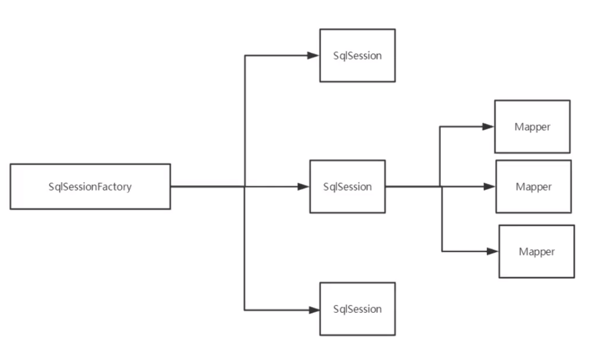

# 1、简介

## 1.1 什么是Mybatis


- MyBatis 是一款优秀的**持久层框架**
- 它支持自定义 SQL、存储过程以及高级映射
- MyBatis 免除了几乎所有的 JDBC 代码以及设置参数和获取结果集的工作
- MyBatis 可以通过简单的 XML 或注解来配置和映射原始类型、接口和 Java POJO（Plain Old Java Objects，普通老式 Java 对象）为数据库中的记录。


> 如何获取Mybatis?

- maven仓库

  ```xml
  <!-- https://mvnrepository.com/artifact/org.mybatis/mybatis -->
  <dependency>
      <groupId>org.mybatis</groupId>
      <artifactId>mybatis</artifactId>
      <version>3.5.6</version>
  </dependency>
  ```

- Github：https://github.com/mybatis/mybatis-3/releases

- 中文文档：https://mybatis.org/mybatis-3/zh/index.html


# 2、第一个Mybatis程序

## 2.1、搭建环境

**1、搭建数据库**

```sql
CREATE DATABASE `mybatis`;

USE `mybatis`;

DROP TABLE IF EXISTS `user`;

CREATE TABLE `user` (
`id` int(20) NOT NULL,
`name` varchar(30) DEFAULT NULL,
`pwd` varchar(30) DEFAULT NULL,
PRIMARY KEY (`id`)
) ENGINE=InnoDB DEFAULT CHARSET=utf8;

insert  into `user`(`id`,`name`,`pwd`) values (1,'狂神','123456'),(2,'张三','abcdef'),(3,'李四','987654');
```


**2、导入Mybatis相关jar包**

```xml
<!--        mysql驱动-->
        <dependency>
            <groupId>mysql</groupId>
            <artifactId>mysql-connector-java</artifactId>
            <version>8.0.21</version>
        </dependency>
        <!--        mybatis-->
        <!-- https://mvnrepository.com/artifact/org.mybatis/mybatis -->
        <dependency>
            <groupId>org.mybatis</groupId>
            <artifactId>mybatis</artifactId>
            <version>3.5.6</version>
        </dependency>
        <dependency>
            <groupId>junit</groupId>
            <artifactId>junit</artifactId>
        </dependency>
        <!--        junit-->
        <dependency>
            <groupId>org.springframework.boot</groupId>
            <artifactId>spring-boot-starter-web</artifactId>
        </dependency>
```


## 2.2、创建一个模块

- **编写MyBatis核心配置文件**

  > resources-mybatis-config.xml

  ```xml
  <?xml version="1.0" encoding="UTF-8" ?>
  <!DOCTYPE configuration
          PUBLIC "-//mybatis.org//DTD Config 3.0//EN"
          "http://mybatis.org/dtd/mybatis-3-config.dtd">
  <configuration>
      <environments default="development">
          <environment id="development">
              <transactionManager type="JDBC"/>
              <dataSource type="POOLED">
                  <property name="driver" value="com.mysql.jdbc.Driver"/>
                  <property name="url" value="jdbc:mysql://localhost:3306/mybatis?useSSL=true&amp;useUnicode=true&amp;characterEncoding=utf8"/>
                  <property name="username" value="root"/>
                  <property name="password" value="123456"/>
              </dataSource>
          </environment>
      </environments>
  </configuration>
  ```

- **编写Mybatis工具类**

  > utils-MybatisUtils

  ```java
  package com.geek.utils;
  
  import org.apache.ibatis.io.Resources;
  import org.apache.ibatis.session.SqlSession;
  import org.apache.ibatis.session.SqlSessionFactory;
  import org.apache.ibatis.session.SqlSessionFactoryBuilder;
  
  import java.io.IOException;
  import java.io.InputStream;
  
  /**
   * @ClassName MybatisUtils
   * @Description TODO
   * @Author Lambert
   * @Date 2020/11/3 16:24
   * @Version 1.0
   **/
  public class MybatisUtils {
      private static SqlSessionFactory sqlSessionFactory;
  
      static {
          try {
              //使用Mybatis 第一步：获取sqlSessionFactory对象
              String resource = "mybatis-config.xml";
              InputStream inputStream = Resources.getResourceAsStream(resource);
              SqlSessionFactory sqlSessionFactory = new SqlSessionFactoryBuilder().build(inputStream);
          } catch (IOException e) {
              e.printStackTrace();
          }
      }
  
      /**
       * 获取SqlSession连接
       * sqlSession完全包含了面向数据库执行SQL命令所需的所有方法
       * @return
       */
      public static SqlSession getSqlSession(){
          return sqlSessionFactory.openSession();
      }
  }
  
  ```


## 2.3、编写代码

- **实体类**

  ```java
  package com.geek.pojo;
  
  import lombok.AllArgsConstructor;
  import lombok.Data;
  import lombok.NoArgsConstructor;
  
  
  /**
   * @ClassName User
   * @Description TODO
   * @Author Lambert
   * @Date 2020/11/3 17:20
   * @Version 1.0
   **/
  @Data
  @NoArgsConstructor
  @AllArgsConstructor
  public class User{
      private int id;
      private String name;
      private String pwd;
  }
  ```

- **Dao接口**

  ```JAVA
  package com.geek.dao;
  
  import com.geek.pojo.User;
  
  import java.util.List;
  
  /**
   * @ClassName UserDao
   * @Description TODO
   * @Author Lambert
   * @Date 2020/11/5 8:57
   * @Version 1.0
   **/
  public interface UserDao {
      List<User> getUserList();
  }
  ```

- **接口实现类**由原来的UserDaoImpl转变为一个Mapper配置文件

  ```JAVA
  <?xml version="1.0" encoding="UTF-8" ?>
  <!DOCTYPE mapper
          PUBLIC "-//mybatis.org//DTD Mapper 3.0//EN"
          "http://mybatis.org/dtd/mybatis-3-mapper.dtd">
  <!--namespace绑定一个对应的Dao/Mapper接口-->
  <mapper namespace="com.geek.dao.UserDao">
  <!--    查询语句 -->
  <!--    id:方法名,resultType:返回值类型,resultMap:返回集合-->
      <select id="getUserList" resultType="com.geek.pojo.User">
          select * from mybatis.user;
      </select>
  </mapper>
  ```

## 2.4 测试

注意点：

org.apache.ibatis.binding.BindingException: Type interface com.geek.dao.UserDao is not known to the MapperRegistry.

解决：核心配置文件中注册mapper

```properties
<mappers>
    <mapper resource="com/geek/dao/UserMapper.xml"/>
</mappers>
```

每个项目都要在pom.xml的build中配置resource,来防止我们资源导出失败的问题

```xml
<build>
    <resources>
        <resource>
            <directory>src/main/java</directory>
            <includes>
                <include>**/*.properties</include>
                <include>**/*.xml</include>
            </includes>
            <filtering>false</filtering>
        </resource>
        <resource>
            <directory>src/main/resources</directory>
            <includes>
                <include>**/*.properties</include>
                <include>**/*.xml</include>
            </includes>
            <filtering>false</filtering>
        </resource>
    </resources>
</build>
```


- junit测试

  ```java
  package com.geek.dao;
  /**
   * @ClassName UserDaoTest
   * @Description TODO
   * @Author Lambert
   * @Date 2020/11/5 9:12
   * @Version 1.0
   **/
  public class UserDaoTest {
      @Test
      public void test() {
          //获得sqlsession对象
          SqlSession sqlSession = MybatisUtils.getSqlSession();
          //方式一:getMapper
          UserDao mapper = sqlSession.getMapper(UserDao.class);
          List<User> userList = mapper.getUserList();
  
          for (User user: userList) {
              System.out.println(user);
          }
  
          //关闭SqlSession
          sqlSession.close();
      }
  }
  
  ```

# 3、CRUD

## 1、namespace

namespace的包名要和Dao/Mapper接口的包名一致

## 2、select

- id：就是对应的namespace中的方法名
- resultType：sql语句执行的返回值
-  parameterType：参数类型 

1. **编写接口**

   ```java
   /**
    * @ClassName UserDao
    * @Description TODO
    * @Author Lambert
    * @Date 2020/11/5 8:57
    * @Version 1.0
    **/
   public interface UserMapper {
       //根据ID查询用户
       User getUserById(int id);
   }
   ```

2. **编写对应的mapper中的sql语句**

   ```xml
   <!--    查询语句 -->
   <!--    id:方法名,resultType:返回值类型,resultMap:返回集合-->
   <select id="getUserById" resultType="com.geek.pojo.User" parameterType="int">
       select * from mybatis.user where id = #{id};
   </select>
   ```

3. **测试**

   ```java
       /**
    * @ClassName UserDaoTest
    * @Description TODO
    * @Author Lambert
    * @Date 2020/11/5 9:12
    * @Version 1.0
    **/
   public class UserDaoTest {
   	@Test
       public void getUserById(){
           //获得sqlsession对象
           SqlSession sqlSession = MybatisUtils.getSqlSession();
           //getMapper
           UserMapper mapper = sqlSession.getMapper(UserMapper.class);
           User user = mapper.getUserById(1);
           System.out.println(user);
   		//关闭session对象
           sqlSession.close();
       }
   }
   ```


## 3、insert

> **增删改需要提交事务**

1. **编写接口**

   ```java
   /**
    * @ClassName UserDao
    * @Description TODO
    * @Author Lambert
    * @Date 2020/11/5 8:57
    * @Version 1.0
    **/
   public interface UserMapper {
   	//插入一个用户
       int addUser(User user);
   }
   ```

   

2. **编写对应mapper的sql语句**

   ```xml
   <!--对象中的属性，可以直接取出来-->
       <insert id="addUser" parameterType="com.geek.pojo.User">
           insert into mybatis.user (id,name,pwd) values (#{id},#{name},#{pwd});
       </insert>
   ```

   

3. **测试**

   ```java
   /**
    * @ClassName UserDaoTest
    * @Description TODO
    * @Author Lambert
    * @Date 2020/11/5 9:12
    * @Version 1.0
    **/
   public class UserDaoTest {
   	//增删改需要提交事务
       @Test
       public void addUser(){
           SqlSession sqlSession = MybatisUtils.getSqlSession();
   
           UserMapper mapper = sqlSession.getMapper(UserMapper.class);
           int res = mapper.addUser(new User(4,"王五","159357"));
           if (res > 0){
               System.out.println("插入成功!");
           }
   
           //提交事务
           sqlSession.commit();
   
           sqlSession.close();
       }
   }
   ```

## 4、update

```xml
<update id="updateUser" parameterType="com.geek.pojo.User">
    update mybatis.user set name = #{name},pwd=#{pwd} where id = #{id};
</update>
```

## 5、delete

```xml
<delete id="deleteUser" parameterType="int">
    delete from mybatis.user where id = #{id};
</delete>
```


## 6、万能Map

假设，我们的实体类，或者数据库中的表、字段或者参数过多，我们应该考虑使用Map！

```java
//插入一个用户
int addUser2(Map<String,Object> map);
```

```XML
<!--    传递KEY的Map-->
<insert id="addUser2" parameterType="map">
    insert into mybatis.user (id,name,pwd) values (#{userId},#{userName},#{password});
</insert>
```

```java
    @Test
    public void addUser2(){
        SqlSession sqlSession = MybatisUtils.getSqlSession();

        UserMapper mapper = sqlSession.getMapper(UserMapper.class);
        Map<String, Object> map = new HashMap<String, Object>();
        map.put("userId","5");
        map.put("userName","Hello");
        map.put("password","222155");

        int res = mapper.addUser2(map);
		if(res > 0){
            System.out.println("插入成功!")
        }
        sqlSession.commit();
        sqlSession.close();
    }
```


Map传递参数，直接在sql中取出即可！【parameterType="map"】

对象传递参数，直接在sql中取出对象的属性即可！【parameterType="Object"】

只有一个基本类型参数的情况下，可以直接在sql中取到 【parameterType可不写】

多个参数用Map，或者注解！


## 7、模糊查询

1. Java代码执行的时候，传递通配符% %

   ```java
   List<User> userList = mapper.getUserLike("%李%");
   
   <select id=”getUserLink”>
   select * from user where name like #{key}
   </select>
   ```

2. 在sql语句中拼接通配符，会引起sql注入

   ```java
   list<name> userList = mapper.getUserLike("李");
   
   <select id=”getUserLink”>
       select * from user where name like "%"#{key}"%"
   </select>
   ```


# 4、配置解析

## 1、核心配置文件

- mybatis-config.xml
- Mybatis的配置文件包含了会深深影响Mybatis行为的设置和属性信息
  - configuration（配置）
    - properties（属性）
    - settings（设置）
    - typeAliases（类型别名）
    - typeHandlers（类型处理器）
    - objectFactory（对象工厂）
    - plugins（插件）
    - environments（环境配置）
      - environment（环境变量）
      - transactionManager（事务管理器）
      - dataSource（数据源）
  - databaseIdProvider（数据库厂商标识）
  - mappers（映射器）

## 2、环境配置（environments）

MyBatis可以配置称适应多种环境

**尽管可以配置多个环境，但每个SqlSessionFactory实例只能选择一个环境**

学会使用配置多套运行环境

Mybatis默认的事务管理就是JDBC ，连接池：POOLED

## 3、属性（properties）

我们可以通过properties属性来实现引用配置文件	

这些属性可以在外部进行配置，并可以进行动态替换。你既可以在典型的 Java 属性文件中配置这些属性，也可以在 properties 元素的子元素中设置。【db.properties】

> 编写一个配置文件 db.properties

```properties
driver=com.mysql.cj.jdbc.Driver
url=jdbc:mysql://localhost:3306/mybatis?useSSL=true&amp;serverTimezone=UTC&amp;useUnicode=true&amp;characterEncoding=utf8
username=root
password=123456
```

> 在核心配置文件中映入

```xml
<!--    引入外部配置文件-->
    <properties resource="db.properties"/>
```

or

```xml
<!--    引入外部配置文件-->
    <properties resource="db.properties">
        <property name="username" value="root"/>
    </properties>
```

- 可以直接引入外部文件
- 可以在其中增加一些属性配置
- 如果两个文件有同一个字段，优先使用外部配置文件


## 4、类型别名（typeAilases）

- 类型别名可为 Java 类型设置一个缩写名字
- 它仅用于 XML 配置，意在降低冗余的全限定类名书写。

```xml
<!--    可以给实体类取别名-->
    <typeAliases>
        <typeAlias type="com.geek.pojo.User" alias="User"/>
    </typeAliases>
```

```java
    <select id="getUserList" resultType="User">
        select * from mybatis.user;
    </select>
```

也可以指定一个包名，MyBatis 会在包名下面搜索需要的 Java Bean，比如：

扫描实体类的包，它的默认别名就为这个类的类名，首字母小写

```xml
    <typeAliases>
        <package name="com.geek.pojo"/>
    </typeAliases>
```

```java
    <select id="getUserList" resultType="user">
        select * from mybatis.user;
    </select>
```

在实体类比较少的时候，使用第一种方式

如果实体类十分多，建议使用第二种

第一种可以DIY别名，第二种须在实体类上添加注解@Alias("别名")


## 5、设置

这是 MyBatis 中极为重要的调整设置，它们会改变 MyBatis 的运行时行为

| 设置名             | 描述                                                         | 有效值                                                       | 默认值 |
| :----------------- | :----------------------------------------------------------- | :----------------------------------------------------------- | :----- |
| cacheEnabled       | 全局性地开启或关闭所有映射器配置文件中已配置的任何缓存。     | true \| false                                                | true   |
| lazyLoadingEnabled | 延迟加载的全局开关。当开启时，所有关联对象都会延迟加载。 特定关联关系中可通过设置 `fetchType` 属性来覆盖该项的开关状态。 | true \| false                                                | false  |
| logImpl            | 指定 MyBatis 所用日志的具体实现，未指定时将自动查找。        | SLF4J \| LOG4J \| LOG4J2 \| JDK_LOGGING \| COMMONS_LOGGING \| STDOUT_LOGGING \| NO_LOGGING | 未设置 |

```xml
<settings>
    <!--        标准日志工厂-->
    <setting name="logImpl" value="STDOUT_LOGGING"/>
    <!--        是否开启驼峰命名-->
    <setting name="mapUnderscoreToCamelCase" value="true"/>
    <!--        开启全局缓存-->
    <setting name="cacheEnabled" value="true"/>
</settings>
```

## 6、其他配置 

- typeHandlers（类型处理器）
- objectFactory（对象工厂）
- plugins（插件）
  - mybatis-generator-core
  - mybatis-plus
  - 通用mapper


## 7、映射器（mappers）

MapperRegistry：注册绑定我们的Mapper文件；

方式一：【推荐】

```xml
<!--    每一个Mapper.xml都需要在Mybatis核心配置文件中注册-->
    <mappers>
        <mapper resource="com/geek/dao/UserMapper.xml"/>
    </mappers>
```

方式二：使用class文件绑定注册

```xml
<mappers>
	<mapper class="com.geek.dao.UserMapper"/>
</mappers>
```

注意点：

- 接口和他的Mapper配置文件必须同名
- 接口和他的Mapper配置文件必须在同一个包下

方式三：使用扫描包进行注入绑定

```xml
    <mappers>
        <package name="com.geek.dao"/>
    </mappers>
```

注意点：

- 接口和他的Mapper配置文件必须同名
- 接口和他的Mapper配置文件必须在同一个包下


## 8、生命周期和作用域

生命周期和作用域时至关重要的，因为错误的使用会 导致非常严重的并发问题

**SqlSessionFactoryBuilder：**

- 一旦创建了SqlSessionFactory，就不再需要他了
- 局部变量

**SqlSessionFactory：**

- 说白了就是可以想象为数据库连接池
- SqlSessionFactory一旦被创建在运行期间一直存在，没有任何理由丢弃它或重新创建一个实例
- 因此SqlSessionFactory的最佳作用域是应用作用域
- 最简单的就是单例模式或者静态单例模式

**SqlSession：**

- 连接到连接池的一个请求
- SqlSession的实例不能线程安全的，因此不能被共享，所以它的最佳作用域是请求或方法作用域
- 用完之后需要赶紧关闭，否则资源被占用



这里每一个Mapper表示一个具体的业务


# 5、解决属性名和字段名不一致的问题

## 1、问题

> 实体类字段和数据库字段名不同，查询时在实体类中找不到pwd字段 返回null


**解决方案一：**

```xml
<select id="getUserById" resultType="com.geek.pojo.User">
    select id,name,pwd as password from mybatis.user where id = #{id};
</select>
```

## 2、resultMap

结果集映射

> id name pwd			数据库字段
>
> id name password	实体类属性

```xml
<!--    结果集映射-->
    <resultMap id="UserMap" type="User">
<!--        column数据库字段 property实体类中的属性-->
        <result column="id" property="id"/>
        <result column="name" property="name"/>
        <result column="pwd" property="password"/>
    </resultMap>
    
    <select id="getUserById" resultMap="UserMap">
        select * from mybatis.user where id = #{id};
    </select>
```

- `resultMap`元素是Mybatis中最重要强大的元素
- ResultMap的设计思想是，对于简单的语句根本不需要配置显式的结果映射，而对于复杂一点的语句只需要描述他们的关系就行了
- `ResultMap`最优秀的地方在于，虽然你已经对它相当了解了，但是根本不需要显式地用到他们 


# 6、日志

## 1、日志工厂

如果一个数据库操作出现了异常，我们需要排错。日志就是最好的助手！

方法：sout、debug、日志工厂

| 设置名  | 描述                                                  | 有效值                                                       | 默认值 |
| :------ | :---------------------------------------------------- | :----------------------------------------------------------- | :----- |
| logImpl | 指定 MyBatis 所用日志的具体实现，未指定时将自动查找。 | SLF4J \| LOG4J \| LOG4J2 \| JDK_LOGGING \| COMMONS_LOGGING \| STDOUT_LOGGING \| NO_LOGGING | 未设置 |

- SLF4J 

- LOG4J ★
- LOG4J2 
- JDK_LOGGING 
- COMMONS_LOGGING 
- STDOUT_LOGGING  ★
- NO_LOGGING

在Mybatis中具体使用哪个日志实现，在设置中设定

**STDOUT_LOGGING标准日志输出**

在mybatis核心配置文件中，配置我们的日志

```xml
<!--    标准的日志工厂实现-->
    <settings>
        <setting name="logImpl" value="STDOUT_LOGGING"/>
    </settings>
```

输出结果：


## 2、Log4j

> 什么是log4j？

- Log4j是Apache的一个开源项目，通过使用Log4j，我们可以控制日志信息输送的目的地是控制台、文件、GUI组件
- 我们也可以控制每一条日志的输出格式
- 通过定义每一条日志信息的级别，我们能够更加细致地控制日志的生成过程
- 通过一个配置文件来灵活地进行配置，而不需要修改应用的代码。


1. 先导入log4j的包

   ```xml
   <!-- https://mvnrepository.com/artifact/log4j/log4j -->
   <dependency>
       <groupId>log4j</groupId>
       <artifactId>log4j</artifactId>
       <version>1.2.17</version>
   </dependency>
   ```

2. log4j.properties

   ```properties
   #将等级为DEBUG的日志信息输出到console和file这两个目的地，console和file的定义在下面的代码
   log4j.rootLogger=DEBUG,console,file
   
   #控制台输出的相关设置
   log4j.appender.console = org.apache.log4j.ConsoleAppender
   log4j.appender.console.Target = System.out
   log4j.appender.console.Threshold=DEBUG
   log4j.appender.console.layout = org.apache.log4j.PatternLayout
   log4j.appender.console.layout.ConversionPattern=【%c】-%m%n
   
   #文件输出的相关设置
   log4j.appender.file = org.apache.log4j.RollingFileAppender
   log4j.appender.file.File=./log/kuang.log
   log4j.appender.file.MaxFileSize=10mb
   log4j.appender.file.Threshold=DEBUG
   log4j.appender.file.layout=org.apache.log4j.PatternLayout
   log4j.appender.file.layout.ConversionPattern=【%p】【%d{yy-MM-dd}】【%c】%m%n
   
   #日志输出级别
   log4j.logger.org.mybatis=DEBUG
   log4j.logger.java.sql=DEBUG
   log4j.logger.java.sql.Statement=DEBUG
   log4j.logger.java.sql.ResultSet=DEBUG
   log4j.logger.java.sql.PreparedStatement=DEBUG
   ```

3. 配置log4j为日志的实现

   ```xml
   <settings>
       <setting name="logImpl" value="LOG4J"/>
   </settings>
   ```

4. Log4j的使用

   

**Log4j简单使用**

1. 在要使用log4j的类中，导入log4j的包

2. 日志对象，参数为当前类的class

   ```java
   static Logger logger = Logger.getLogger(UserDaoTest.class);
   ```

3. 日志级别

   ```java
   logger.info("info:进入了testlog4j方法");
   logger.debug("debug:进入了testlog4j方法");
   logger.error("error:进入了testlog4j方法");
   ```


# 7、分页

## 7.1、使用Limit分页

```sql
语法：SELECT * from user limit startIndex,pageSize
SELECT * from user limit 3; #[0,3]
```


> 使用Mybatis实现分页

1. 接口

   ```java
   //分页查询
   List<User> getUserByLimit(Map<String,Integer> map);
   ```

2. Mapper.XML 

   ```xml
   <select id="getUserByLimit" resultMap="UserMap" parameterType="map" resultType="User">
       select * from user limit #{startIndex},#{pageSize};
   </select>
   ```

3. 测试

   ```java
   @Test
   public void getUserByLimit(){
       SqlSession sqlSession = MybatisUtils.getSqlSession();
   
       UserMapper mapper = sqlSession.getMapper(UserMapper.class);
       HashMap<String, Integer> map = new HashMap<>();
       map.put("startIndex",1);
       map.put("pageSize",2);
       List<User> userList =  mapper.getUserByLimit(map);
       for (User user : userList) {
           System.out.println(user);
       }
   
       sqlSession.close();
   }
   ```


## 7.2、RowBounds分页

> 不再使用SQL实现分页

1. 接口

   ```java
   //Bounds实现分页2
   List<User> getUserByRowBounds();
   ```

2. mapper

   ```xml
   <select id="getUserByRowBounds" resultMap="UserMap">
       select * from user;
   </select>
   ```

3. 测试

   ```java
   @Test
   public void getUserByRowBounds(){
       SqlSession sqlSession = MybatisUtils.getSqlSession();
   
       //RowBounds
       RowBounds rowBounds = new RowBounds(1, 2);
   
       //通过Java代码层面实现分页
       List<User> userList = sqlSession.selectList("com.geek.dao.UserMapper.getUserByRowBounds",null,rowBounds);
       for (User user : userList) {
           System.out.println(user);
       }
   
       sqlSession.close();
   }
   ```


## 7.3、分页插件


# 8、使用注解开发

## 8.1、使用注解开发

1. 注解在接口上实现

   ```java
       @Select("select * from user")
       List<User> getUserList();
   ```

2. 需要在核心配置文件中绑定接口

   ```xml
   <!--    绑定接口-->
   <mappers>
       <mapper class="com.geek.dao.UserMapper"/>
   </mappers>
   ```

3. 测试

   ```java
   @Test
   public void getUserList(){
       SqlSession sqlSession = MybatisUtils.getSqlSession();
   
       UserMapper mapper = sqlSession.getMapper(UserMapper.class);
       List<User> userList = mapper.getUserList();
       for (User user : userList) {
           System.out.println(user);
       }
   
       sqlSession.close();
   }
   ```


## 8.2、CRUD

我们可以在工具类创建的时候实现自动提交事务

```java
public static SqlSession getSqlSession(){
    return sqlSessionFactory.openSession(true);
}
```


1. 编写接口，增加注解

   ```java
   /**
    * @ClassName UserMapper
    * @Description TODO
    * @Author Lambert
    * @Date 2020/11/16 15:57
    * @Version 1.0
    **/
   public interface UserMapper {
       @Select("select * from user")
       List<User> getUserList();
   
       //方法存在多个参数，所有的参数前面必须加上@Param("id")
       @Select("select * from user where id = #{id}")
       User getUserById(@Param("id") int id);
   
       @Insert("insert into user(id,name,pwd) values(#{id},#{name},#{password})")
       int addUser(User user);
   
       @Update("update user set name = #{name},pwd = #{password} where id = #{id}")
       int updateUser(User user);
   
       @Delete("delete from user where id = #{id}")
       int deleteUser(@Param("id") int id);
   }
   ```

   

2. 测试类

   ```java
   @Test
   public void getUserById(){
       SqlSession sqlSession = MybatisUtils.getSqlSession();
       UserMapper mapper = sqlSession.getMapper(UserMapper.class);
   
       User user = mapper.getUserById(1);
       System.out.println(user);
   
       sqlSession.close();
   }
   
   @Test
   public void addUser(){
       SqlSession sqlSession = MybatisUtils.getSqlSession();
       UserMapper mapper = sqlSession.getMapper(UserMapper.class);
   
       int res = mapper.addUser(new User(5, "Hello","2222"));
       System.out.println(res);
   
       sqlSession.close();
   
   }
   
   @Test
   public void updateUser(){
       SqlSession sqlSession = MybatisUtils.getSqlSession();
       UserMapper mapper = sqlSession.getMapper(UserMapper.class);
   
       int res = mapper.updateUser(new User(5, "王五", "123123"));
       System.out.println(res);
   
       sqlSession.close();
   
   }
   
   @Test
   public void deleteUser(){
       SqlSession sqlSession = MybatisUtils.getSqlSession();
       UserMapper mapper = sqlSession.getMapper(UserMapper.class);
   
       int res = mapper.deleteUser(5);
       System.out.println(res);
   
       sqlSession.close();
   
   }
   ```

   ！我们必须要将接口注册绑定到我们的核心配置文件中


**关于@Param()注解**

- 基本类型的参数或者String类型，需要加上
- 引用类型不需要加
- 如果只有一个基本类型的话，可以忽略，但是建议加上
- 在SQL中引用的就是我们这里的@Param("uid")中设定的属性名


# 9、Lombook

使用步骤：

- 导入lombok依赖

  ```xml
  <dependency>
      <groupId>org.projectlombok</groupId>
      <artifactId>lombok</artifactId>
      <optional>true</optional>
  </dependency>
  ```

- 在实体类加注解即可

  ```java
  @Data
  @AllArgsConstructor
  @NoArgsConstructor
  ```

- ```java
  @Getter and @Setter
  @FieldNameConstants	//字段属性常量
  @ToString 
  @EqualsAndHashCode	//
  @AllArgsConstructor, @RequiredArgsConstructor and @NoArgsConstructor
  @Log, @Log4j, @Log4j2, @Slf4j, @XSlf4j, @CommonsLog, @JBossLog, @Flogger, @CustomLog
  @Data
  @Builder
  @SuperBuilder
  @Singular
  @Delegate
  @Value
  @Accessors
  @Wither
  @With
  @SneakyThrows
  ```

- @Data：无参构造、get、set、tostring、hashcode、equals

# 10、多对一处理

```sql
CREATE TABLE `teacher` (
  `id` INT(10) NOT NULL,
  `name` VARCHAR(30) DEFAULT NULL,
  PRIMARY KEY (`id`)
) ENGINE=INNODB DEFAULT CHARSET=utf8

INSERT INTO teacher(`id`, `name`) VALUES (1, '秦老师'); 

CREATE TABLE `student` (
  `id` INT(10) NOT NULL,
  `name` VARCHAR(30) DEFAULT NULL,
  `tid` INT(10) DEFAULT NULL,
  PRIMARY KEY (`id`),
  KEY `fktid` (`tid`),
  CONSTRAINT `fktid` FOREIGN KEY (`tid`) REFERENCES `teacher` (`id`)
) ENGINE=INNODB DEFAULT CHARSET=utf8INSERT INTO `student` (`id`, `name`, `tid`) VALUES ('1', '小明', '1'); 
INSERT INTO `student` (`id`, `name`, `tid`) VALUES ('2', '小红', '1'); 
INSERT INTO `student` (`id`, `name`, `tid`) VALUES ('3', '小张', '1'); 
INSERT INTO `student` (`id`, `name`, `tid`) VALUES ('4', '小李', '1'); 
INSERT INTO `student` (`id`, `name`, `tid`) VALUES ('5', '小王', '1');
```

- association– 一个复杂类型的关联；许多结果将包装成这种类型
  - 嵌套结果映射 – 关联可以是 `resultMap` 元素，或是对其它结果映射的引用
- collection– 一个复杂类型的集合
  - 嵌套结果映射 – 集合可以是 `resultMap` 元素，或是对其它结果映射的引用

## 1、测试环境搭建

1. 导入lombok

2. 新建实体类Teacher，Student

   ```java
   @Data
   public class Student {
       private int id;
       private String name;
       //学生要关联一个老师
       private Teacher teacher;
   }
   ```

   ```java
   @Data
   public class Teacher {
       private int id;
       private String name;
   }
   ```

   

3. 新建Mapper接口

   ```java
   public interface TeacherMapper {
       @Select("select * from teacher where id = #{tid}")
       Teacher getTeacher(@Param("tid") int id);
   }
   ```

4. 建立Mapper.XML文件

   ```xml
   <?xml version="1.0" encoding="UTF-8" ?>
   <!DOCTYPE mapper
           PUBLIC "-//mybatis.org//DTD Config 3.0//EN"
           "http://mybatis.org/dtd/mybatis-3-mapper.dtd">
   <mapper namespace="com.geek.dao.StudentMapper">
   
   </mapper>
   ```

   ```xml
   <?xml version="1.0" encoding="UTF-8" ?>
   <!DOCTYPE mapper
           PUBLIC "-//mybatis.org//DTD Config 3.0//EN"
           "http://mybatis.org/dtd/mybatis-3-mapper.dtd">
   <mapper namespace="com.geek.dao.TeacherMapper">
   
   </mapper>
   ```

5. 在核心配置文件中绑定注册我们的Mapper接口或者文件

   ```xml
   <!--    绑定接口-->
   <mappers>
       <mapper class="com.geek.dao.TeacherMapper"/>
       <mapper class="com.geek.dao.StudentMapper"/>
   </mappers>
   ```

6. 测试


## 2、按照查询嵌套处理

```xml
<!--    思路：
            1、查询所有的学生信息
            2、根据查询出来的学生的tid，寻找对应的老师 子查询
-->
<select id="getStudent" resultMap="StudentTeacher">
    select * from student;
</select>

<resultMap id="StudentTeacher" type="Student">
    <result property="id" column="id"/>
    <result property="name" column="name"/>
    <!--        复杂的属性，我们需要单独处理 对象：asssciation 集合：collection-->
    <association property="teacher" column="tid" javaType="Teacher" select="getTeacher"/>
</resultMap>

<select id="getTeacher" resultType="Teacher">
    select * from teacher where id = #{id};
</select>
```

## 3、按照结果嵌套处理

```xml
<!--    思路2: 按照结果嵌套处理-->
<select id="getStudent2" resultMap="StudentTeacher2">
    select s.id sid,s.name sname,t.name tname from student s,teacher t where s.tid = t.id;
</select>

<resultMap id="StudentTeacher2" type="Student">
    <result property="id" column="sid"/>
    <result property="name" column="sname"/>
    <association property="teacher" javaType="Teacher">
        <result property="name" column="tname"/>
    </association>
</resultMap>
```

回顾Mysql多对一查询方式：

- 子查询
- 联表查询


# 11、一对多处理

## 1、环境搭建

**实体类**

```java
@Data
public class Student {
    private int id;
    private String name;
    //学生要关联一个老师
    private int tid;
}
```

```java
@Data
public class Teacher {
    private int id;
    private String name;

    //一个老师拥有多个学生
    private List<Student> student;
}
```

## 2、按照结果嵌套处理

```xml
<!--    按结果嵌套查询-->
<select id="getStudent" resultMap="StudentTeacher">
    select s.id sid,s.name sname,t.name tname,t.id tid from student s,teacher t where s.tid = t.id and t.id = #{tid};
</select>
<resultMap id="StudentTeacher" type="Teacher">
    <result property="id" column="tid"/>
    <result property="name" column="tname"/>
    <!--        复杂的属性，我们需要单独处理 对象：asssciation 集合：collection
            javaType=""指定属性类型
            集合中的泛型信息 我们使用ofType获取
-->
    <collection property="students" ofType="Student">
        <result property="id" column="sid"/>
        <result property="name" column="sname"/>
        <result property="tid" column="tid"/>
    </collection>
</resultMap>
```

```java
@Test
public void getStudent(){
    SqlSession sqlSession = MybatisUtils.getSqlSession();
    TeacherMapper mapper = sqlSession.getMapper(TeacherMapper.class);
    Teacher studentList = mapper.getStudent(1);
    System.out.println(studentList);
    sqlSession.close();
}
```

## 小结

1. 关联 -association 【多对一】
2. 集合 -association 【一对多】
3. javaType & ofType
   1. JavaType 用来指定实体类中属性的类型
   2. ofType 用来指定映射到List或者集合中pojo类型，泛型中的约束类型


# 12、动态SQL

> 什么是动态SQL：
>
> 动态SQL就是指根据不同的条件生成不同的sql语句
>
> 利用动态SQL这一特性可以彻底摆脱这种痛苦

- if
- choose (when, otherwise)
- trim (where, set)
- foreach

## 1、搭建环境

```sql
CREATE TABLE `blog`(
`id` VARCHAR(50) NOT NULL COMMENT '博客id',
`title` VARCHAR(100) NOT NULL COMMENT '博客标题',
`author` VARCHAR(30) NOT NULL COMMENT '博客作者',
`create_time` DATETIME NOT NULL COMMENT '创建时间',
`views` INT(30) NOT NULL COMMENT '浏览量'
)ENGINE=INNODB DEFAULT CHARSET=utf8
```

创建一个基础工程：

1. 导包

2. 编写配置文件

3. 编写实体类

   ```java
   @Data
   public class Blog {
       private int id;
       private String title;
       private String author;
       private Date createTime;
       private int views;
   }
   ```

1. 编写实体类对应Mapper接口和Mapper.XML文件

## 2、IF

```xml
<select id="queryBlogIF" parameterType="map" resultType="blog">
    select * from blog
    <if test="title != null">
        and title = #{title}
    </if>
    <if test="author != null">
        and author = #{author}
    </if>
</select>
```


## 3、choose（when，otherwise）

```xml
<select id="queryBlogChoose" parameterType="map" resultType="blog">
    select * from blog
    <where>
        <choose>
            <when test="author != null">
                author = #{author}
            </when>
            <when test="title != null">
                and title = #{title}
            </when>
            <otherwise>
                and views = #{views}
            </otherwise>
        </choose>
    </where>
</select>
```


## 4、trim（where，set）

> **where**

```xml
<select id="queryBlogIF" parameterType="map" resultType="blog">
    select * from blog
    <where>
        <if test="title != null">
            title = #{title}
        </if>
        <if test="author != null">
            and author = #{author}
        </if>
    </where>
</select>
```

> **set**

```xml
<update id="updateBlog" parameterType="map">
    update blog
    <set>
        <if test="title != null">
            title = #{title},
        </if>
        <if test="author != null">
            author = #{author}
        </if>
    </set>
    where id = #{id}
</update>
```

## 5、SQL片段

有的时候我们可能会将一些功能的部分抽取出来，方便复用

1. 使用sql标签抽取公共的部分

   ```xml
   <sql id="if-title-author">
       <if test="title != null">
           title = #{title},
       </if>
       <if test="author != null">
           author = #{author}
       </if>
   </sql>
   ```

   

2. 在需要使用的地方使用Include标签引用

   ```xml
   <select id="queryBlogIF" parameterType="map" resultType="blog">
       select * from blog
       <where>
           <include refid="if-title-author"></include>
       </where>
   </select>
   ```

注意事项：

- 最好基于单表来定义sql片段
- 不要存在where标签


## 6、ForEach

```java
//查询第1-2-3号记录的博客
List<Blog> queryBlogForeach(Map map);
```

```xml
<select id="queryBlogForeach" parameterType="map" resultType="blog">
    select * from blog
    <where>
        <foreach collection="ids" item="id" open="and (" close=")" separator="or">
            id = #{id}
        </foreach>
    </where>
</select>
```

```java
@Test
public void queryBlogForeach(){
    SqlSession sqlSession = MybatisUtils.getSqlSession();
    BlogMapper mapper = sqlSession.getMapper(BlogMapper.class);
    HashMap map = new HashMap();
    ArrayList<Integer> ids = new ArrayList<Integer>();
    ids.add(1);
    ids.add(2);
    ids.add(3);
    map.put("ids",ids);
    List<Blog> blogs = mapper.queryBlogForeach(map);
    for (Blog blog : blogs) {
        System.out.println(blog);
    }
    sqlSession.close();
}
```


# 13、缓存

> 查询 ： 数据库 ，耗资源
>
> ​			一次查询的结果，暂存到内存中：缓存

## 13.1、一级缓存

测试步骤：

1. 开启日志

2. 测试在一个Session中查询两次相同记录

3. 查看日志输出

   

缓存失效：

1. 查询不同的东西

2. 增删改操作，可能会改变原来的数据，所以必定会刷新缓存

3. 查询不同的Mapper.xml

4. 手动清理缓存

   ```java
   sqlSession.clearCache();//手动清理缓存
   ```

小结：一级缓存默认是开启的，只在一次SqlSession中有效，也就是拿到连接到关闭连接这个区间  一级缓存相当于一个Map

## 13.2、二级缓存

工作机制：

- 一个会话查询一条数据，这个数据会被放到当前会话的一级缓存中
- 如果当前会话被关闭了，这个会话对应的一级缓存就没了，一级缓存中的数据会被存到二级缓存中
- 新的会话查询信息，就可以从二级缓存中获取内容
- 不同的mapper查出的数据会被放在自己对应的缓存中

步骤：

1. 开启全局缓存

   ```xml
   <!--        开启全局缓存-->
   <setting name="cacheEnabled" value="true"/>
   ```

2. 在要使用二级缓存的Mapper中开启

   ```xml
   <!--    在当前的mapper中使用二级缓存-->
   <cache/>
   ```

   也可以自定义参数

   ```xml
   <!--    FIFO缓存、每隔60s自动刷新缓存、最多存512个缓存、只读-->
   <cache eviction="FIFO" flushInterval="60000" size="512" readOnly="true"/>
   ```

3. 测试

   1. 问题：我们需要将实体类序列化，否则会报错

      ```java
      Caused by: java.io.NotSerializableException: com.geek.pojo.User
      ```

   2. 解决：实体类实现Serializable

      ```java
      public class User implements Serializable
      ```

小结：

- 只要开启了缓存，在同一个mapper下就有效
- 所有的数据都会放在一级缓存中
- 只有当会话提交或关闭的时候才会转存到二级缓存

## 13.3、缓存原理


## 13.4、自定义缓存-ehcache

> Ehcache是一种广泛使用的开源Java分布式缓存。主要面向通用缓存

使用Ehcache

1. 导包

   ```xml
   <!-- https://mvnrepository.com/artifact/org.mybatis.caches/mybatis-ehcache -->
   <dependency>
       <groupId>org.mybatis.caches</groupId>
       <artifactId>mybatis-ehcache</artifactId>
       <version>1.2.1</version>
   </dependency>
   ```

2. 在mapper中指定我们的ehcache缓存实现

   ```xml
   <cache type="org.mybatis.caches.ehcache.EhcacheCache"/>
   ```

   

